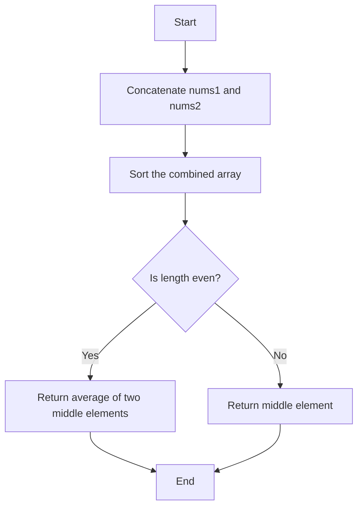
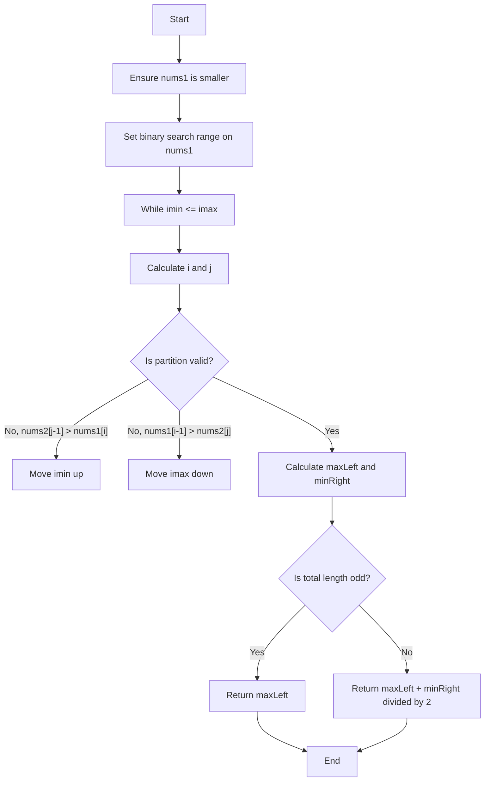

## Visual Explanation with Mermaid Diagrams

### 1. Brute Force Solution

---

### 2. Optimal Solution (Binary Search)

## Comprehensive Explanation: Median of Two Sorted Arrays

### 1. Brute Force Solution

**Algorithm:**
- Concatenate both arrays (`nums1` and `nums2`) into a new array.
- Sort the combined array.
- If the total length is odd, return the middle element.
- If even, return the average of the two middle elements.

**Big O Analysis:**
- **Time Complexity:** O((m + n) log(m + n))
	- Concatenation: O(m + n)
	- Sorting: O((m + n) log(m + n))
	- Accessing median: O(1)
- **Space Complexity:** O(m + n) (for the new combined array)

**Summary:**
This approach is simple but inefficient for large arrays because sorting dominates the runtime.

---

### 2. Optimal Solution (Binary Search)

**Algorithm:**
- Uses binary search to partition the two arrays so the left partition contains the same number of elements as the right partition.
- Ensures all elements in the left partition are less than or equal to those in the right.
- Calculates the median based on the maximum of the left and minimum of the right partitions.

**Steps:**
- Always binary search the smaller array for efficiency.
- For each partition, check if the partition is valid:
	- If not, adjust the binary search range.
- Once a valid partition is found, compute the median.

**Big O Analysis:**
- **Time Complexity:** O(log(min(m, n))) (binary search on the smaller array)
- **Space Complexity:** O(1) (no extra space used)

**Summary:**
This is the most efficient known algorithm for this problem, leveraging binary search and partitioning logic to achieve logarithmic time.
